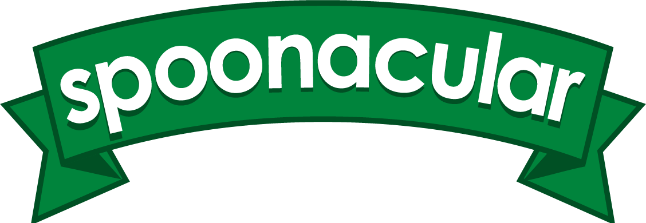

# Fork n Spoon

 <br>

### _Find Some Food!_

A React app created by [Nethanel Kohen](https://github.com/nethanelkohen) and [Martin Pham](https://github.com/martinliempham) that that allows users to scan the barcode of a product/ingredient (or manually enter) which then renders a list of ingredients, recipes and nutrition facts of dish.

[Find it here](https://fork-n-spoon.herokuapp.com/)

<br>

## Getting Started

```bash
$ git clone https://github.com/martinliempham/fork-n-spoon.git
$ cd fork-n-spoon
$ npm install
$ npm start
```

## Project Structure

```
├── Fork-n-Spoon    # Source code
│   ├── App.jsx         ## Begins navigation
│   ├── App.css         ## Holds App CSS
│   ├── index.js        ## Handles Expo render data
│   ├── src         ## React source code
│   │   └── components     ### React components
│   │   │     └── #### BarcodeRead.jsx
│   │   │     └── #### Ingredients.jsx
│   │   │     └── #### Logo.jsx
│   │   │     └── #### Nutrition.jsx
│   │   │     └── #### QuaggaScan.jsx
│   │   └── img     ### Images (png,jpg)
│   ├── public     ## Any shared components
│   │   └── index.html     ### Renders HTML
│   │   └── manifest.json     ###
```

## What's Inside


[React](https://reactjs.org/)


[QuaggaJS](https://serratus.github.io/quaggaJS/)


[Edamam API](https://www.edamam.com/)



[Spoonacular API](https://spoonacular.com/)

<br>

# Inspiration


* [Lose It](https://www.loseit.com) - Barcode scanning feature

## Credits

Nethanel Kohen (contributor)
Martin Pham (contributor)

## License

This React app is under the [MIT License](https://github.com/martinliempham/fork-n-spoon/blob/master/LICENSE).
